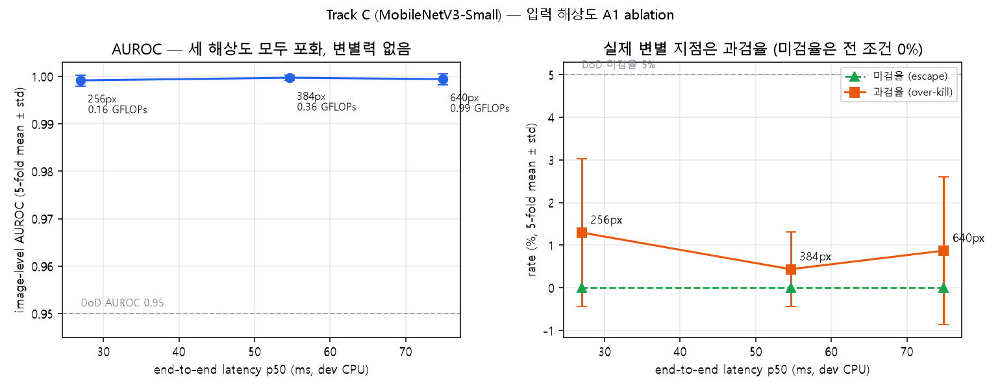

# A1 Ablation — 입력 해상도 (Track C)

- SOP: SOP-MVTEC-CABLE-001 §8.2 A1, §9.1-1 (경량화 1축)
- 생성일: 2026-09-21
- 고정 조건: arch `mobilenet_v3_small` / epochs 50(patience 15) / batch 16 / lr 0.001 / aug `medium` / pretrained True / seed 42 / 5-fold (동일 분할)

> 해상도 외 모든 설정이 동일하다. 단일 변수 비교 조건 충족(§8.2).

## 1. 정확도 · 하드웨어 종합 (§7.1 — 같은 표에 기재)

| 입력 | AUROC | 미검율 % | 과검율 % | Recall@FPR5 | F1 | GFLOPs | e2e p50 ms | e2e p95 ms | 모델만 p50 ms |
|---|---|---|---|---|---|---|---|---|---|
| **640** | 0.9994 ± 0.0012 | 0.00 ± 0.00 | 0.87 ± 1.74 | 1.0000 ± 0.0000 | 0.9875 ± 0.0250 | 0.988 | 74.88 | 93.98 | 54.35 |
| **384** | 0.9997 ± 0.0006 | 0.00 ± 0.00 | 0.43 ± 0.87 | 1.0000 ± 0.0000 | 0.9935 ± 0.0129 | 0.357 | 54.61 | 75.19 | 28.01 |
| **256** | 0.9992 ± 0.0011 | 0.00 ± 0.00 | 1.30 ± 1.73 | 1.0000 ± 0.0000 | 0.9814 ± 0.0249 | 0.16 | 26.95 | 34.54 | 26.6 |

파라미터 수는 해상도와 무관하게 1.52M / FP32 6.08 MB로 동일하다 (전역 평균 풀링 구조). 해상도 축소의 이득은 **연산량과 지연시간**에서 나온다.

### 기준(최고 해상도) 대비 상대치

| 입력 | GFLOPs 비 | e2e p50 비 | AUROC 차 | 미검율 차 %p |
|---|---|---|---|---|
| 640 | 1.000× | 1.000× | +0.0000 | +0.00 |
| 384 | 0.361× | 0.729× | +0.0003 | +0.00 |
| 256 | 0.162× | 0.360× | -0.0003 | +0.00 |

## 2. 클래스별 recall (§7.3) — 해상도 민감도

⚠ = §3.2에서 해상도 축소에 민감할 것으로 지목한 클래스

| 클래스 | n | 640px | 384px | 256px |
|---|---|---|---|---|
| bent_wire | 11 | 1.000 ± 0.000 | 1.000 ± 0.000 | 1.000 ± 0.000 |
| cable_swap | 10 | 1.000 ± 0.000 | 1.000 ± 0.000 | 1.000 ± 0.000 |
| combined | 9 | 1.000 ± 0.000 | 1.000 ± 0.000 | 1.000 ± 0.000 |
| cut_inner_insulation | 12 | 1.000 ± 0.000 | 1.000 ± 0.000 | 1.000 ± 0.000 |
| cut_outer_insulation ⚠ | 8 | 1.000 ± 0.000 | 1.000 ± 0.000 | 1.000 ± 0.000 |
| missing_cable | 10 | 1.000 ± 0.000 | 1.000 ± 0.000 | 1.000 ± 0.000 |
| missing_wire ⚠ | 8 | 1.000 ± 0.000 | 1.000 ± 0.000 | 1.000 ± 0.000 |
| poke_insulation ⚠ | 8 | 1.000 ± 0.000 | 1.000 ± 0.000 | 1.000 ± 0.000 |

## 3. 점수 분리폭 · 임계값 안정성

완전분리된 fold의 간격(log10)과 겹친 fold 수. 간격이 좁을수록 배포 시 임계 보정이 까다롭다(§7.2 보완).

| 입력 | 분리된 fold | 겹친 fold | 간격 log10 (min / 중앙 / max) | τ 범위 |
|---|---|---|---|---|
| 640 | 4 | 1 | 0.25 / 0.44 / 0.81 | 5.5e-06 ~ 0.68 |
| 384 | 4 | 1 | 0.19 / 0.57 / 0.90 | 1.2e-08 ~ 0.97 |
| 256 | 3 | 2 | 0.25 / 0.37 / 0.61 | 1.3e-05 ~ 0.0031 |

## 4. 정확도-지연시간 파레토

## 5. 결론

- **DoD(§1.3) 정확도 기준을 만족하는 가장 가벼운 설정: 256px** — AUROC 0.9992, 미검율 0.00%, 0.16 GFLOPs, e2e p50 26.95ms
- 최고 해상도(640px) 대비 연산량 0.16×, 지연 0.36×

### 해석 시 주의 (Track C 리포트 §4와 동일하게 적용)

1. 모든 수치는 **val fold 기준**이며 τ도 같은 val에서 정했다 → 낙관적 편향. 편향 없는 값은 홀드아웃(P5)에서만 얻는다.
2. fold당 val 불량 15~16장. 미검 0건이어도 rule of three 기준 fold 단위 95% 상한은 약 20%다.
3. 클래스별 recall은 클래스당 n=8~12에서 나온 값이다. 해상도 간 미세한 차이를 유의미한 차이로 읽지 않는다(§7.4).
4. 지연시간은 **개발 머신 CPU** 값이다. 타깃 하드웨어 확정 후 §9.3 프로토콜(열 스로틀링 포함)로 재측정해야 배포 판단이 된다.
5. 해상도를 낮춰 정확도가 유지되더라도, **놓치는 결함의 종류**가 바뀔 수 있다. §2 클래스별 표에서 소형 결함 감시 클래스(⚠)의 recall을 개별로 확인한다.
