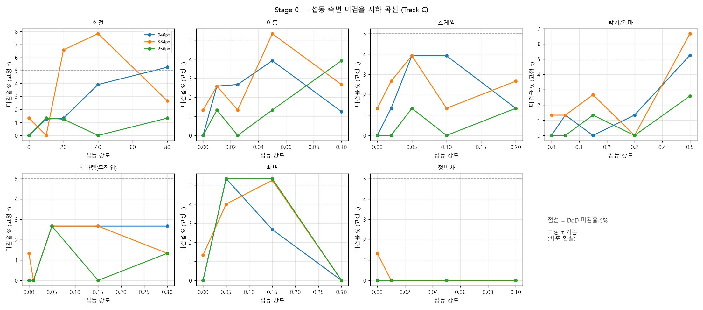

# Stage 0 — 합성 섭동 강건성 벤치마크

- 목적: `docs/연구후보/` 두 제안 문서의 전제("MVTec 조건을 벗어나면 현 모델이 무너진다") 정량 검증
- 배경: 최종 목표가 **실제 산업 제품 양/불 판정**이므로 MVTec은 대리 데이터다. 촬영 조건 변동에 대한 강건성은 원 데이터로 측정할 수 없어 합성 섭동으로 대체한다.
- 생성일: 2026-09-22
- 섭동 적용 해상도: 640px(센서 영상 가정) → 모델 입력 해상도로 리사이즈
- 기준 강도(1배): `reports/dataset_variation_cable.md` 실측값

## 방법 — 임계값 처리

| 표기 | 의미 |
|---|---|
| **고정 τ** | 무섭동 val에서 정한 τ를 그대로 사용. **배포 현실에 해당** — 임계값은 정상 기준 데이터로 정해지고 현장 변동에 따라 자동으로 바뀌지 않는다. |
| 재보정 τ | 섭동 데이터에서 τ를 다시 정함. 고정 τ와의 차이가 크면 **표현은 살아 있고 임계값만 밀린 것** — 현장 재보정으로 복구 가능하다는 뜻. |
| AUROC | 임계값 무관 순위 품질. 이것이 무너지면 **표현 자체가 무너진 것**이라 재보정으로도 복구 불가. |

## `EXP_C_mnv3s_640_fp32_all_20260921` (입력 640px)

| 축 | 강도 | AUROC | 미검율 % (고정 τ) | 미검율 % (재보정 τ) | 과검율 % (고정 τ) | Recall@FPR5 |
|---|---|---|---|---|---|---|
| clean | 무섭동 | 0.9994 ± 0.0012 | 0.00 ± 0.00 | 0.00 ± 0.00 | 0.87 ± 1.74 | 1.0000 |
| rot | ±10° | 0.9989 ± 0.0017 | 1.25 ± 2.50 | 1.33 ± 2.67 | 1.73 ± 2.53 | 0.9867 |
| rot | ±20° | 0.9983 ± 0.0028 | 1.33 ± 2.67 | 1.33 ± 2.67 | 1.73 ± 2.53 | 0.9867 |
| rot | ±40° | 0.9969 ± 0.0038 | 3.92 ± 3.20 | 1.33 ± 2.67 | 3.03 ± 5.07 | 0.9867 |
| rot | ±80° | 0.9960 ± 0.0045 | 5.25 ± 2.63 | 1.33 ± 2.67 | 2.59 ± 3.20 | 0.9867 |
| trans | ±1% | 0.9983 ± 0.0021 | 2.58 ± 3.17 | 1.33 ± 2.67 | 3.02 ± 2.96 | 0.9867 |
| trans | ±2.5% | 0.9986 ± 0.0029 | 2.67 ± 3.27 | 1.33 ± 2.67 | 1.30 ± 2.61 | 0.9867 |
| trans | ±5% | 0.9957 ± 0.0062 | 3.92 ± 3.20 | 2.67 ± 3.27 | 2.16 ± 3.37 | 0.9733 |
| trans | ±10% | 0.9983 ± 0.0027 | 1.25 ± 2.50 | 0.00 ± 0.00 | 3.44 ± 3.24 | 1.0000 |
| scale | ±2% | 0.9997 ± 0.0006 | 1.33 ± 2.67 | 0.00 ± 0.00 | 1.73 ± 2.53 | 1.0000 |
| scale | ±5% | 0.9991 ± 0.0012 | 3.92 ± 5.29 | 0.00 ± 0.00 | 2.16 ± 3.37 | 1.0000 |
| scale | ±10% | 0.9989 ± 0.0017 | 3.92 ± 3.20 | 1.33 ± 2.67 | 2.16 ± 3.37 | 0.9867 |
| scale | ±20% | 0.9943 ± 0.0078 | 1.33 ± 2.67 | 2.67 ± 3.27 | 4.75 ± 6.19 | 0.9733 |
| bright | ±5% | 0.9991 ± 0.0017 | 1.33 ± 2.67 | 1.33 ± 2.67 | 0.43 ± 0.87 | 0.9867 |
| bright | ±15% | 0.9997 ± 0.0006 | 0.00 ± 0.00 | 0.00 ± 0.00 | 1.30 ± 1.73 | 1.0000 |
| bright | ±30% | 0.9968 ± 0.0051 | 1.33 ± 2.67 | 1.33 ± 2.67 | 5.58 ± 5.36 | 0.9867 |
| bright | ±50% | 0.9966 ± 0.0043 | 5.25 ± 2.63 | 2.58 ± 3.17 | 6.01 ± 5.00 | 0.9742 |
| fade | 1% | 0.9997 ± 0.0006 | 0.00 ± 0.00 | 0.00 ± 0.00 | 0.43 ± 0.87 | 1.0000 |
| fade | 5% | 0.9968 ± 0.0029 | 2.67 ± 3.27 | 1.33 ± 2.67 | 4.71 ± 4.75 | 0.9867 |
| fade | 15% | 0.9817 ± 0.0151 | 2.67 ± 3.27 | 8.00 ± 7.77 | 20.13 ± 15.89 | 0.9200 |
| fade | 30% | 0.9095 ± 0.0656 | 2.67 ± 3.27 | 38.33 ± 29.48 | 49.34 ± 17.72 | 0.6167 |
| yellow | 5% | 0.9968 ± 0.0041 | 5.33 ± 4.99 | 2.67 ± 3.27 | 1.30 ± 1.73 | 0.9733 |
| yellow | 15% | 0.9848 ± 0.0162 | 2.67 ± 3.27 | 5.33 ± 4.99 | 12.40 ± 12.51 | 0.9467 |
| yellow | 30% | 0.9654 ± 0.0353 | 0.00 ± 0.00 | 14.58 ± 11.53 | 85.48 ± 23.08 | 0.8542 |
| spec | 면적1% | 0.9780 ± 0.0188 | 0.00 ± 0.00 | 8.00 ± 7.77 | 43.30 ± 27.19 | 0.9200 |
| spec | 면적5% | 0.9122 ± 0.0456 | 0.00 ± 0.00 | 31.67 ± 15.56 | 84.94 ± 18.47 | 0.6833 |
| spec | 면적10% | 0.8852 ± 0.0525 | 0.00 ± 0.00 | 43.17 ± 25.87 | 94.86 ± 6.83 | 0.5683 |

## `EXP_C_mnv3s_384_fp32_all_20260921` (입력 384px)

| 축 | 강도 | AUROC | 미검율 % (고정 τ) | 미검율 % (재보정 τ) | 과검율 % (고정 τ) | Recall@FPR5 |
|---|---|---|---|---|---|---|
| clean | 무섭동 | 0.9991 ± 0.0017 | 1.33 ± 2.67 | 1.33 ± 2.67 | 0.87 ± 1.74 | 0.9867 |
| rot | ±10° | 0.9992 ± 0.0011 | 0.00 ± 0.00 | 0.00 ± 0.00 | 1.29 ± 1.05 | 1.0000 |
| rot | ±20° | 0.9961 ± 0.0023 | 6.58 ± 4.22 | 3.92 ± 3.20 | 1.73 ± 2.53 | 0.9608 |
| rot | ±40° | 0.9911 ± 0.0062 | 7.83 ± 4.82 | 5.25 ± 2.63 | 3.44 ± 1.72 | 0.9475 |
| rot | ±80° | 0.9930 ± 0.0071 | 2.67 ± 5.33 | 6.42 ± 8.04 | 7.30 ± 5.36 | 0.9358 |
| trans | ±1% | 0.9931 ± 0.0119 | 2.58 ± 3.17 | 1.33 ± 2.67 | 1.73 ± 2.53 | 0.9867 |
| trans | ±2.5% | 0.9986 ± 0.0009 | 1.33 ± 2.67 | 0.00 ± 0.00 | 2.15 ± 1.38 | 1.0000 |
| trans | ±5% | 0.9965 ± 0.0070 | 5.33 ± 4.99 | 1.33 ± 2.67 | 0.43 ± 0.85 | 0.9867 |
| trans | ±10% | 0.9919 ± 0.0162 | 2.67 ± 5.33 | 1.33 ± 2.67 | 1.72 ± 2.11 | 0.9867 |
| scale | ±2% | 0.9986 ± 0.0022 | 2.67 ± 3.27 | 1.33 ± 2.67 | 1.73 ± 1.62 | 0.9867 |
| scale | ±5% | 0.9965 ± 0.0070 | 3.92 ± 3.20 | 1.33 ± 2.67 | 0.00 ± 0.00 | 0.9867 |
| scale | ±10% | 0.9994 ± 0.0011 | 1.33 ± 2.67 | 0.00 ± 0.00 | 1.30 ± 1.73 | 1.0000 |
| scale | ±20% | 0.9918 ± 0.0042 | 2.67 ± 3.27 | 5.33 ± 4.99 | 4.75 ± 2.56 | 0.9467 |
| bright | ±5% | 0.9994 ± 0.0007 | 1.33 ± 2.67 | 0.00 ± 0.00 | 0.87 ± 1.06 | 1.0000 |
| bright | ±15% | 0.9974 ± 0.0028 | 2.67 ± 3.27 | 2.67 ± 3.27 | 2.60 ± 4.22 | 0.9733 |
| bright | ±30% | 0.9989 ± 0.0017 | 0.00 ± 0.00 | 0.00 ± 0.00 | 2.58 ± 0.88 | 1.0000 |
| bright | ±50% | 0.9844 ± 0.0170 | 6.67 ± 5.96 | 6.67 ± 8.43 | 5.58 ± 5.50 | 0.9333 |
| fade | 1% | 0.9994 ± 0.0012 | 0.00 ± 0.00 | 0.00 ± 0.00 | 0.87 ± 1.74 | 1.0000 |
| fade | 5% | 0.9988 ± 0.0023 | 2.67 ± 3.27 | 1.33 ± 2.67 | 1.30 ± 1.73 | 0.9867 |
| fade | 15% | 0.9860 ± 0.0071 | 2.67 ± 3.27 | 7.83 ± 2.33 | 12.45 ± 4.95 | 0.9217 |
| fade | 30% | 0.9353 ± 0.0370 | 1.33 ± 2.67 | 30.25 ± 17.13 | 40.30 ± 6.67 | 0.6975 |
| yellow | 5% | 0.9980 ± 0.0041 | 4.00 ± 3.27 | 1.33 ± 2.67 | 0.43 ± 0.87 | 0.9867 |
| yellow | 15% | 0.9907 ± 0.0171 | 5.25 ± 4.97 | 2.67 ± 5.33 | 1.73 ± 2.53 | 0.9733 |
| yellow | 30% | 0.9561 ± 0.0395 | 0.00 ± 0.00 | 21.33 ± 23.63 | 58.83 ± 28.77 | 0.7867 |
| spec | 면적1% | 0.9669 ± 0.0216 | 0.00 ± 0.00 | 19.75 ± 11.94 | 34.25 ± 19.56 | 0.8025 |
| spec | 면적5% | 0.8796 ± 0.0806 | 0.00 ± 0.00 | 51.58 ± 21.63 | 88.75 ± 15.75 | 0.4842 |
| spec | 면적10% | 0.8314 ± 0.1062 | 0.00 ± 0.00 | 49.75 ± 27.47 | 99.57 ± 0.87 | 0.5025 |

## `EXP_C_mnv3s_256_fp32_all_20260921` (입력 256px)

| 축 | 강도 | AUROC | 미검율 % (고정 τ) | 미검율 % (재보정 τ) | 과검율 % (고정 τ) | Recall@FPR5 |
|---|---|---|---|---|---|---|
| clean | 무섭동 | 0.9992 ± 0.0011 | 0.00 ± 0.00 | 0.00 ± 0.00 | 3.02 ± 4.25 | 1.0000 |
| rot | ±10° | 0.9961 ± 0.0042 | 1.33 ± 2.67 | 2.58 ± 3.17 | 6.87 ± 4.41 | 0.9742 |
| rot | ±20° | 0.9973 ± 0.0041 | 1.25 ± 2.50 | 1.25 ± 2.50 | 8.63 ± 7.68 | 0.9875 |
| rot | ±40° | 0.9987 ± 0.0021 | 0.00 ± 0.00 | 1.25 ± 2.50 | 10.32 ± 5.40 | 0.9875 |
| rot | ±80° | 0.9973 ± 0.0028 | 1.33 ± 2.67 | 1.25 ± 2.50 | 12.06 ± 6.52 | 0.9875 |
| trans | ±1% | 0.9980 ± 0.0034 | 1.33 ± 2.67 | 1.33 ± 2.67 | 5.18 ± 5.08 | 0.9867 |
| trans | ±2.5% | 0.9983 ± 0.0020 | 0.00 ± 0.00 | 1.33 ± 2.67 | 6.02 ± 4.62 | 0.9867 |
| trans | ±5% | 0.9963 ± 0.0062 | 1.33 ± 2.67 | 1.33 ± 2.67 | 4.73 ± 3.74 | 0.9867 |
| trans | ±10% | 0.9915 ± 0.0068 | 3.92 ± 3.20 | 5.25 ± 2.63 | 9.04 ± 4.22 | 0.9475 |
| scale | ±2% | 0.9980 ± 0.0015 | 0.00 ± 0.00 | 1.33 ± 2.67 | 4.72 ± 2.87 | 0.9867 |
| scale | ±5% | 0.9986 ± 0.0016 | 1.33 ± 2.67 | 1.33 ± 2.67 | 3.45 ± 4.03 | 0.9867 |
| scale | ±10% | 0.9983 ± 0.0017 | 0.00 ± 0.00 | 1.33 ± 2.67 | 6.01 ± 2.89 | 0.9867 |
| scale | ±20% | 0.9983 ± 0.0017 | 1.33 ± 2.67 | 1.33 ± 2.67 | 9.47 ± 6.08 | 0.9867 |
| bright | ±5% | 0.9989 ± 0.0014 | 0.00 ± 0.00 | 0.00 ± 0.00 | 3.02 ± 3.25 | 1.0000 |
| bright | ±15% | 0.9980 ± 0.0015 | 1.33 ± 2.67 | 1.33 ± 2.67 | 3.89 ± 4.65 | 0.9867 |
| bright | ±30% | 0.9971 ± 0.0044 | 0.00 ± 0.00 | 1.33 ± 2.67 | 7.33 ± 6.82 | 0.9867 |
| bright | ±50% | 0.9903 ± 0.0055 | 2.58 ± 3.17 | 6.58 ± 4.22 | 12.89 ± 8.37 | 0.9342 |
| fade | 1% | 0.9989 ± 0.0014 | 0.00 ± 0.00 | 0.00 ± 0.00 | 2.58 ± 2.52 | 1.0000 |
| fade | 5% | 0.9954 ± 0.0046 | 2.67 ± 3.27 | 2.67 ± 3.27 | 8.59 ± 5.81 | 0.9733 |
| fade | 15% | 0.9796 ± 0.0179 | 0.00 ± 0.00 | 7.75 ± 7.40 | 33.52 ± 14.07 | 0.9225 |
| fade | 30% | 0.8924 ± 0.0199 | 1.33 ± 2.67 | 39.17 ± 13.76 | 65.71 ± 12.73 | 0.6083 |
| yellow | 5% | 0.9978 ± 0.0029 | 5.33 ± 4.99 | 1.33 ± 2.67 | 1.29 ± 1.71 | 0.9867 |
| yellow | 15% | 0.9890 ± 0.0070 | 5.33 ± 4.99 | 6.67 ± 5.96 | 17.57 ± 15.33 | 0.9333 |
| yellow | 30% | 0.9018 ± 0.0658 | 0.00 ± 0.00 | 37.42 ± 29.55 | 81.50 ± 19.78 | 0.6258 |
| spec | 면적1% | 0.9638 ± 0.0273 | 0.00 ± 0.00 | 13.25 ± 9.49 | 60.71 ± 24.56 | 0.8675 |
| spec | 면적5% | 0.8715 ± 0.0605 | 0.00 ± 0.00 | 57.50 ± 24.28 | 97.01 ± 3.94 | 0.4250 |
| spec | 면적10% | 0.8273 ± 0.0545 | 0.00 ± 0.00 | 56.33 ± 18.99 | 100.00 ± 0.00 | 0.4367 |

## 저하 곡선

