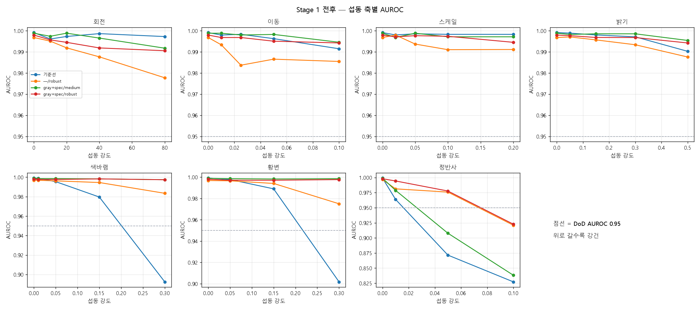

# Stage 1 전후 비교 — 값싼 처방의 강건성 효과

- SOP: SOP-MVTEC-CABLE-001 / `reports/연구후보_분석.md` §6 Stage 1
- 생성일: 2026-09-22
- 기준선: `EXP_C_mnv3s_256_fp32_all_20260921` (prep=— / aug=medium)
- 입력 해상도: 256px (동일), 분할·시드 동일

## 0. 변형 정의

| 실험 | 전처리 | 증강 | 비고 |
|---|---|---|---|
| `EXP_C_mnv3s_256_fp32_all_20260921` | `—` | `medium` | **기준선** |
| `EXP_C_mnv3s_256_fp32_all_20260922_aug-robust` | `—` | `robust` |  |
| `EXP_C_mnv3s_256_fp32_all_20260922_prep-grayspec` | `gray+spec` | `medium` |  |
| `EXP_C_mnv3s_256_fp32_all_20260922_prep-grayspec_aug-robust` | `gray+spec` | `robust` |  |

> 증강 범위는 시험 섭동보다 좁게 설정했다(채널 게인 ±15% vs 시험 30%, 정반사 ≤3% vs 시험 10%). 증강과 시험 분포가 같으면 강건성 측정이 의미를 잃기 때문이다.

## 1. 무섭동 정확도 · 지연시간 (§7.1 — 같은 표)

| 실험 | AUROC | 미검율 % | 과검율 % | e2e p50 ms | e2e p95 ms | 모델만 p50 ms | 전처리 비용 ms |
|---|---|---|---|---|---|---|---|
| `EXP_C_mnv3s_256_fp32_all…` | 0.9992 ± 0.0011 | 0.00 ± 0.00 | 1.30 ± 1.73 | 26.9 | 34.5 | 26.6 | +0.0 |
| `EXP_C_mnv3s_256_fp32_all…` | 0.9971 ± 0.0045 | 1.33 ± 2.67 | 1.30 ± 1.74 | 24.9 | 29.7 | 19.6 | -2.1 |
| `EXP_C_mnv3s_256_fp32_all…` | 0.9988 ± 0.0017 | 0.00 ± 0.00 | 0.87 ± 1.06 | 48.8 | 54.6 | 17.4 | +21.8 |
| `EXP_C_mnv3s_256_fp32_all…` | 0.9980 ± 0.0041 | 1.33 ± 2.67 | 0.87 ± 1.74 | 48.0 | 60.0 | 24.1 | +21.1 |

> DoD 지연 상한 100 ms(§1.3) 대조. 전처리 비용은 기준선 e2e p50 대비 증분이다.

## 2. 축별 강건성 — 최대 섭동에서의 AUROC

| 실험 | 무섭동 | 회전 | 이동 | 스케일 | 밝기 | 색바램 | 황변 | 정반사 |
|---|---|---|---|---|---|---|---|---|
| `EXP_C_mnv3s_256_fp32_all…` | 0.9992 | 0.9973 | 0.9915 | 0.9983 | 0.9903 | 0.8924 | 0.9018 | 0.8273 |
| `EXP_C_mnv3s_256_fp32_all…` | 0.9968 | 0.9777 | 0.9855 | 0.9911 | 0.9876 | 0.9835 | 0.9750 | 0.9210 |
| `EXP_C_mnv3s_256_fp32_all…` | 0.9988 | 0.9918 | 0.9946 | 0.9971 | 0.9954 | 0.9974 | 0.9986 | 0.8382 |
| `EXP_C_mnv3s_256_fp32_all…` | 0.9980 | 0.9906 | 0.9942 | 0.9945 | 0.9942 | 0.9974 | 0.9977 | 0.9228 |

최대 섭동 강도: 회전 ±80°, 이동 ±10%, 스케일 ±20%, 밝기 ±50%, 색바램 30%, 황변 30%, 정반사 면적10%

### 기준선 대비 AUROC 변화

| 실험 | 무섭동 | 회전 | 이동 | 스케일 | 밝기 | 색바램 | 황변 | 정반사 |
|---|---|---|---|---|---|---|---|---|
| `EXP_C_mnv3s_256_fp32_all…` | -0.0023 | -0.0195 | -0.0060 | -0.0072 | -0.0027 | +0.0910 | +0.0732 | +0.0937 |
| `EXP_C_mnv3s_256_fp32_all…` | -0.0003 | -0.0055 | +0.0031 | -0.0012 | +0.0052 | +0.1050 | +0.0968 | +0.0110 |
| `EXP_C_mnv3s_256_fp32_all…` | -0.0012 | -0.0067 | +0.0027 | -0.0038 | +0.0040 | +0.1050 | +0.0959 | +0.0955 |

## 3. 최대 섭동에서의 미검율 (재보정 τ) — 표현 붕괴 여부

재보정 τ로도 미검율이 높으면 임계값 문제가 아니라 **표현 자체가 무너진 것**이다.

| 실험 | 회전 | 이동 | 스케일 | 밝기 | 색바램 | 황변 | 정반사 |
|---|---|---|---|---|---|---|---|
| `EXP_C_mnv3s_256_fp32_all…` | 1.2 | 5.2 | 1.3 | 6.6 | 39.2 | 37.4 | 56.3 |
| `EXP_C_mnv3s_256_fp32_all…` | 7.9 | 4.0 | 5.1 | 5.2 | 10.6 | 9.2 | 26.2 |
| `EXP_C_mnv3s_256_fp32_all…` | 5.2 | 2.7 | 2.7 | 1.3 | 2.7 | 0.0 | 57.7 |
| `EXP_C_mnv3s_256_fp32_all…` | 5.2 | 1.3 | 2.6 | 2.7 | 1.3 | 1.3 | 35.6 |

## 4. 최대 섭동에서의 과검율 (고정 τ) — 판정기 기능 정지 여부

과검율 100%는 전 샘플을 NG로 판정한다는 뜻이며 판정기가 기능을 멈춘 상태다.

| 실험 | 무섭동 | 회전 | 이동 | 스케일 | 밝기 | 색바램 | 황변 | 정반사 |
|---|---|---|---|---|---|---|---|---|
| `EXP_C_mnv3s_256_fp32_all…` | 3.0 | 12.1 | 9.0 | 9.5 | 12.9 | 65.7 | 81.5 | 100.0 |
| `EXP_C_mnv3s_256_fp32_all…` | 1.7 | 3.4 | 3.8 | 6.0 | 7.3 | 13.8 | 18.9 | 57.9 |
| `EXP_C_mnv3s_256_fp32_all…` | 0.9 | 4.3 | 3.0 | 6.9 | 6.0 | 5.2 | 3.0 | 100.0 |
| `EXP_C_mnv3s_256_fp32_all…` | 0.9 | 4.3 | 1.7 | 2.6 | 3.0 | 2.2 | 2.6 | 57.1 |

## 5. 전처리 검출 실패율

| 실험 | 조건 | 원판 검출 실패 % | 회전 추정 실패 % |
|---|---|---|---|
| `EXP_C_mnv3s_256_fp32_all…` | clean 무섭동 | 0.0 | 0.0 |
| `EXP_C_mnv3s_256_fp32_all…` | clean 무섭동 | 0.0 | 0.0 |

> 검출 실패 시 항등 변환으로 후퇴하므로 판정이 중단되지는 않으나, 해당 샘플은 전처리 효과를 받지 못한다.

## 저하 곡선 비교

## 6. 판정

### `EXP_C_mnv3s_256_fp32_all_20260922_aug-robust`

- 개선: 색바램 +0.091, 황변 +0.073, 정반사 +0.094
- 악화: 회전 -0.020
- 무섭동 AUROC 변화: -0.0023
- e2e p50 지연 변화: -2.1 ms (→ 24.9 ms, DoD 상한 100 ms)

### `EXP_C_mnv3s_256_fp32_all_20260922_prep-grayspec`

- 개선: 색바램 +0.105, 황변 +0.097, 정반사 +0.011
- 악화: 없음
- 무섭동 AUROC 변화: -0.0003
- e2e p50 지연 변화: +21.8 ms (→ 48.8 ms, DoD 상한 100 ms)

### `EXP_C_mnv3s_256_fp32_all_20260922_prep-grayspec_aug-robust`

- 개선: 색바램 +0.105, 황변 +0.096, 정반사 +0.095
- 악화: 없음
- 무섭동 AUROC 변화: -0.0012
- e2e p50 지연 변화: +21.1 ms (→ 48.0 ms, DoD 상한 100 ms)

### 해석 시 주의

1. 모든 수치는 **val fold 기준**이며 τ도 같은 val에서 정했다 — 낙관적 편향. 홀드아웃은 아직 사용하지 않았다.
2. fold당 val 불량 15~16장. 축별 AUROC 차이가 0.01 미만이면 유의하다고 보지 않는다(§7.4).
3. 합성 섭동은 실제 라인 변동의 **대리**다. 섭동 모형이 현장과 다르면 결론도 달라진다.
4. robust 증강을 쓴 변형은 시험 섭동과 **같은 축**을 학습에서 겪었다(범위는 더 좁게). 따라서 그 축의 개선은 '분포 내 강건성'이며, 완전히 새로운 변동에 대한 일반화는 별도 문제다.
5. 지연시간은 개발 머신 CPU 값이다. 타깃 하드웨어에서 §9.3으로 재측정해야 한다.
